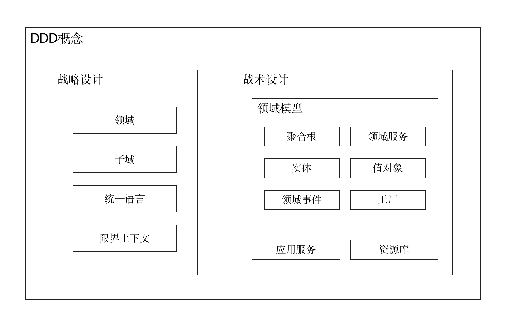
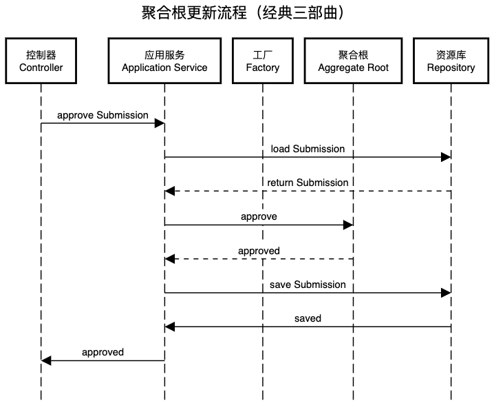

# DDD 笔记

以 [产品代码都给你看了，可别再说不会DDD](https://docs.mryqr.com/ddd-introduction/) 为主线，仅做适当的补充。

## 1. DDD 入门

- SaaS

  即软件即服务（Software as a Service），是用户能够通过互联网连接使用的基于云的应用程序。它不需要用户将软件产品安装在自己的电脑或服务器上，而是通过 Web 浏览器连接到该应用。

- **DDD 是面向对象进阶。**

## 2. DDD 概念大白话



- 成员已创建事件类

  ```java
  @Getter
  @TypeAlias("MEMBER_CREATED_EVENT")
  @NoArgsConstructor(access = PRIVATE)
  public class MemberCreatedEvent extends DomainEvent {
      private String memberId;
  
      public MemberCreatedEvent(String memberId, User user) {
          super(MEMBER_CREATED, user); // 调用超类的构造方法
          this.memberId = memberId;
      }
  
  } 
  ```

  `super()` 方法是在调用超类的构造方法。

  Java 中构造方法的继承：

  - 子类的构造过程中必须调用父类的构造方法。

  - 子类可在自己的构造方法中使用 `super()` 来调用父类的构造方法，也可以使用 this 来调用本类的另外的构造方法 。
  - 如果使用 `super()` 来调用父类的构造方法必须写在子类构造方法的第一行。
  - 如果子类的构造方法中没有显示的调用父类的构造方法，则系统默认的调用父类的无参的构造方法。 
  - 如果子类的构造方法中既没有显示调用父类的构造方法，而父类中又没有无参的构造方法，则编译出错。

- 实体对象与值对象的区别

  最直观的区别则是实体对象有 ID，而值对象没有 ID. 

##  3. 战略设计

- Java 中，项目、模块、包、类之间的关系

  [博客园：java学习01-项目，模块，包，类的关系](https://www.cnblogs.com/seekwhale13/p/17899260.html)

- DDD 中的界限上下文可以以微服务的形式划分，也可以以单体项目中的模块的形式划分。DDD的意义在于“DDD之于软件”，而不是“DDD之于微服务”。

## 4. 代码工程结构

- 将技术分包作为顶级分包是一种反模式（Anti-patterns，指用来解决问题的带有共同性的不良方法）

  在做分包时，一个最常见的反模式是将技术分包作为上层分包，然后在各技术分包下再划分业务包。DDD社区更加推崇的分包方式是**先业务，后技术**，即上层包先按照业务进行划分，然后在各个业务包内部可以再按照技术分包。

- 业务分包

  每一个业务分包对应一个聚合根。

- 技术分包

  技术分包一般包括以下子分包：

  - `command`：用于存放应用服务以及命令对象等。
  - `domain`：用于存放所有领域模型。
  - `eventhandler`：用于存放领域事件处理器。
  - `infrastructure`：用于存放技术基础设施。
  - `query`：用于存放查询逻辑。

## 5. 请求处理流程

- 聚合根更新流程

  

```java
//SubmissionCommandService

@Transactional
public void approveSubmission(String submissionId,
                              ApproveSubmissionCommand command,
                              User user) {
    // 先通过资源库 SubmissionRepository 的 byIdAndCheckTenantShip() 方法获取到需要操作的 Submission
    // 也许资源库中有和数据库交互的 DO，但是 DO 转化为聚合根的过程是在资源库中完成的
    Submission submission = submissionRepository.byIdAndCheckTenantShip(submissionId, user);

    App app = appRepository.cachedById(submission.getAppId());
    Page page = app.pageById(submission.getPageId());
    SubmissionPermissions permissions = permissionChecker.permissionsFor(user,
            app,
            submission.getGroupId());
    permissions.checkCanApproveSubmission(submission, page, app);

    submission.approve(command.isPassed(),
            command.getNote(),
            page,
            user);

    submissionRepository.houseKeepSave(submission, app);

    log.info("Approved submission[{}].", submissionId);
}
```

## DDD 项目中使用 Lombok 的正确姿势

- DDD 中，可能用到 Lombok 的概念有聚合根（Aggregate Root）、实体（Entity）和值对象（Value Object）等。

- 外部只能通过聚合根完成对其内部状态的改变，而不能直接操作聚合根内部的字段。

- @Value

  `@Value` 注解是 `@Data` 的不可变版本，自动生成所有字段的 `getter()` 方法、`toString()` 方法、`equals()` 和 `hashCode()` 方法，以及一个全参数的构造函数，并将所有字段设为 `private` 和 `final`。

## 参考网站

[Lombok 实战教程 - @Value | 轻松实现不可变类](https://blog.csdn.net/qq_33240556/article/details/139201231)