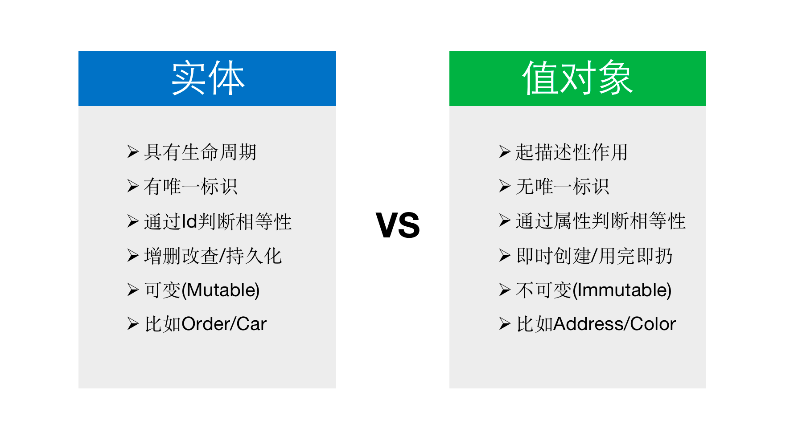
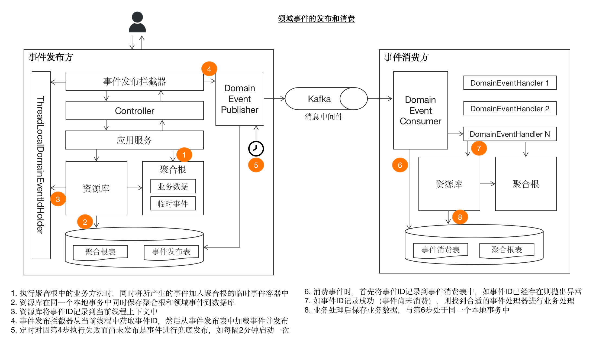

# DDD 笔记

以 [产品代码都给你看了，可别再说不会DDD](https://docs.mryqr.com/ddd-introduction/) 为主线，仅做适当的补充。

## 1. DDD 入门

- SaaS

  即软件即服务（Software as a Service），是用户能够通过互联网连接使用的基于云的应用程序。它不需要用户将软件产品安装在自己的电脑或服务器上，而是通过 Web 浏览器连接到该应用。
- **DDD 是面向对象进阶。**

## 2. DDD 概念大白话


- 战术设计

  - 应用服务 xxxCommandService
  
  - 资源库 xxxRepository
  
    - `byId()` 根据 ID 获取聚合根，示例：
  
      ```java
      AppedQr appedQr = qrRepository.appedQrById(command.getQrId());
      ```

      需要注意的是，这里的查询方法指的是在实现业务逻辑的过程中需要做的查询操作，并不是为了前端显示那种纯粹的查询。因为纯粹的查询操作不见得一定要放到资源库中，而是可以作为一个单独的关注点通过CQRS解决。
  
    - `save()` 保存聚合根，示例：
  
      ```java
      submissionRepository.houseKeepSave(submission, app);
      ```
  
      ```java
      Optional<Group> byIdOptional(String id); // 根据 ID 查找分组，返回 Optional
      ```
  
    - `delete()`  删除聚合根
  
  - 领域模型
  
    - 聚合根 xxx
    - 领域服务
    - 工厂 xxxFactory
  
      - createNewxxx() 创建聚合根对象，示例：
  
        ```java
        Submission submission = submissionFactory.createNewSubmission(
                    answers,
                    qr,
                    page,
                    app,
                    permissions.getPermissions(),
                    command.getReferenceData(),
                    user
            );
        ```
  
      工厂创建聚合根的过程不只是简单地调用聚合根的构造函数，它也是业务逻辑的一部分。因此工厂也属于领域模型的一部分，本质上工厂可以认为是一种特殊形式的领域服务。
  
      每一个聚合根都有一个对应的工厂类用于创建聚合根的对象。
    - 实体
    - 值对象
    - 领域事件
  
- 成员已创建事件类

  ```java
  @Getter
  @TypeAlias("MEMBER_CREATED_EVENT")
  @NoArgsConstructor(access = PRIVATE)
  public class MemberCreatedEvent extends DomainEvent {
      private String memberId;
  
      public MemberCreatedEvent(String memberId, User user) {
          super(MEMBER_CREATED, user); // 调用超类的构造方法
          this.memberId = memberId;
      }
  
  } 
  ```

  `super()` 方法是在调用超类的构造方法。

  Java 中构造方法的继承：

  - 子类的构造过程中必须调用父类的构造方法。
  - 子类可在自己的构造方法中使用 `super()` 来调用父类的构造方法，也可以使用 this 来调用本类的另外的构造方法 。
  - 如果使用 `super()` 来调用父类的构造方法必须写在子类构造方法的第一行。
  - 如果子类的构造方法中没有显示的调用父类的构造方法，则系统默认的调用父类的无参的构造方法。
  - 如果子类的构造方法中既没有显示调用父类的构造方法，而父类中又没有无参的构造方法，则编译出错。
  
- 实体对象与值对象的区别

  最直观的区别则是实体对象有 ID，而值对象没有 ID.

## 3. 战略设计

- Java 中，项目、模块、包、类之间的关系

  [博客园：java学习01-项目，模块，包，类的关系](https://www.cnblogs.com/seekwhale13/p/17899260.html)
- DDD 中的界限上下文可以以微服务的形式划分，也可以以单体项目中的模块的形式划分。DDD的意义在于“DDD之于软件”，而不是“DDD之于微服务”。

## 4. 代码工程结构

- 将技术分包作为顶级分包是一种反模式（Anti-patterns，指用来解决问题的带有共同性的不良方法）

  在做分包时，一个最常见的反模式是将技术分包作为上层分包，然后在各技术分包下再划分业务包。DDD社区更加推崇的分包方式是**先业务，后技术**，即上层包先按照业务进行划分，然后在各个业务包内部可以再按照技术分包。
- 业务分包

  每一个业务分包对应一个聚合根。
- 技术分包

  技术分包一般包括以下子分包：

  - `command`：用于存放应用服务以及命令对象等。
  - `domain`：用于存放所有领域模型。
  - `eventhandler`：用于存放领域事件处理器。
  - `infrastructure`：用于存放技术基础设施。
  - `query`：用于存放查询逻辑。

## 5. 请求处理流程

- 聚合根创建流程

  聚合根的创建通常通过工厂类完成。

  请求流经路线为：控制器(Controller) -> 应用服务(Application Service) -> 工厂(Factory) -> 资源库(Repository)。

  

  Controller 的实现如下：

  ```java
  //SubmissionController
  
  @PostMapping
  @ResponseStatus(CREATED)
  public ReturnId newSubmission(@RequestBody @Valid NewSubmissionCommand command,
                                @AuthenticationPrincipal User user) {
      String submissionId = submissionCommandService.newSubmission(command, user);
      return returnId(submissionId);
  }
  ```

  - @ResponseStatus

    该注解可以用在异常类或 Controller 类及其方法上，作用是设置 HTTP 响应的状态码。
  - 命令对象 NewSubmissionCommand

    命令对象是外部客户端传入的数据（类似于传统 MVC 架构中的 voParam），因此需要将其与领域模型解耦，也即命令对象不能进入到领域模型的内部，其所能到达的最后一站是应用服务。
- 聚合根更新流程

  对聚合根的更新流程通常可以通过“经典三部曲”完成：

  1. 调用资源库获得聚合根
  2. 调用聚合根上的业务方法，完成对聚合根的更新
  3. 再次调用资源库保存聚合根

  此时的请求流经路线为：控制器(Controller) -> 应用服务(Application Service) -> 资源库(Repository) -> 聚合根(Aggregate Root)。

  

  应用服务的实现如下：

  ```java
  //SubmissionCommandService
  
  @Transactional
  public void approveSubmission(String submissionId,
                                ApproveSubmissionCommand command,
                                User user) {
      // 先通过资源库 SubmissionRepository 的 byIdAndCheckTenantShip() 方法获取到需要操作的 Submission
      // 也许资源库中有和数据库交互的 DO，但是 DO 转化为聚合根的过程是在资源库中完成的
      Submission submission = submissionRepository.byIdAndCheckTenantShip(submissionId, user);
  
      App app = appRepository.cachedById(submission.getAppId());
      Page page = app.pageById(submission.getPageId());
      SubmissionPermissions permissions = permissionChecker.permissionsFor(user,
              app,
              submission.getGroupId());
      permissions.checkCanApproveSubmission(submission, page, app);
  
      submission.approve(command.isPassed(),
              command.getNote(),
              page,DDD
              user);
  
      submissionRepository.houseKeepSave(submission, app);
  
      log.info("Approved submission[{}].", submissionId);
  }
  ```

  - 资源库返回的永远是聚合根
  - `@Transactional` 注解加在应用服务类的方法上。
- 聚合根删除流程

  请求流经路线为：控制器(Controller) -> 应用服务(Application Service) -> 资源库(Application Service) -> 聚合根(Aggregate Root) 。

  

## 6. 聚合根与资源库

- 聚合根基类

  在代码实现层面，一般的实践是将所有的聚合根都继承自一个公共基类 `AggregateRoot`.

  - 多租户

- 聚合根基本原则

  - 内聚性原则
  - 对外黑盒原则
  - 不变条件原则
  - 通过 ID 引用其他聚合根原则
  - 与基础设施无关原则

- 资源库

  在 DDD 项目中，通常将资源库分为接口类和实现类，将接口类放置在领域模型 `domain` 包中，而将实现类放置在基础设施 `infrastructure` 包中，这种做法有两点好处：

  1. 通过依赖反转，使得领域模型不依赖于基础设施
  2. 实现资源库的可插拔性，比如未来需要从 MongoDB 迁移到 MySQL，那么只需创建新的实现类即可

## 7. 实体与值对象



- 唯一标识

  在DDD中，所有的聚合根都是实体对象，但并不是所有的实体都是聚合根，不过从实践上来看，绝大多数的实体对象都是聚合根。因此，在DDD项目中最常见的情况是：作为实体对象的聚合根包含了大量的值对象。

  对于聚合根而言，由于已经是领域模型中的顶层对象，其唯一标识应该是全局唯一的；而对于聚合根下的其他实体而言，由于其作用范围被限制在了聚合根内部，因此对应的唯一标识在聚合根下唯一即可。

## 8. 应用服务与领域服务

- 应用服务是领域模型的门面

  应用服务是以业务用例为粒度接收外部请求的，也即应用服务类中的每一个 public 方法即对应一个业务用例。进而意味着应用服务也负责处理事务边界，使得对一个业务用例的处理要么全部成功，要么全部失败。对应到实际编码过程中，`@Tranactional`注解应该主要打到应用服务上。

- 应用服务应该与框架无关

## 9. 领域事件

领域事件（Domain Event）中的“事件”即事件驱动架构（EDA, Event Driven Architecture）中的“事件”之意。




## 10. CQRS


## 项目中使用 Lombok 的正确姿势

- DDD 中，可能用到 Lombok 的概念有聚合根（Aggregate Root）、实体（Entity）和值对象（Value Object）等。
- 外部只能通过聚合根完成对其内部状态的改变，而不能直接操作聚合根内部的字段。
- @Value

  `@Value` 注解是 `@Data` 的不可变版本，自动生成所有字段的 `getter()` 方法、`toString()` 方法、`equals()` 和 `hashCode()` 方法，以及一个全参数的构造函数，并将所有字段设为 `private` 和 `final`。

## 问题

1. 在 DDD 中，voParam 是否要改为 xxxCommand？
   不需要，要看具体的代码规范。

2. xxxCommandService？

   应用服务

## 参考网站

[Lombok 实战教程 - @Value | 轻松实现不可变类](https://blog.csdn.net/qq_33240556/article/details/139201231)
