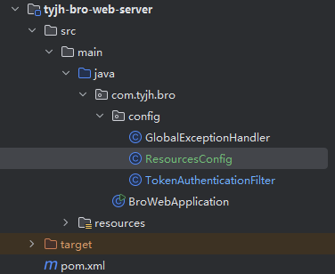

# Spring 笔记

## 跨域配置

```java
package com.tyjh.bro.config;

import org.springframework.beans.factory.annotation.Value;
import org.springframework.context.annotation.Bean;
import org.springframework.context.annotation.Configuration;
import org.springframework.web.cors.CorsConfiguration;
import org.springframework.web.cors.UrlBasedCorsConfigurationSource;
import org.springframework.web.filter.CorsFilter;

import java.util.Arrays;
import java.util.List;

/**
 * 通用配置
 * 
 * @author duanyangyang
 */
@Configuration
public class ResourcesConfig
{

    @Value("${cors.allowOrigins:*}")
    private String allowOrigins;

    /**
     * 跨域配置
     */
    @Bean
    public CorsFilter corsFilter()
    {
        CorsConfiguration config = new CorsConfiguration();
        config.setAllowCredentials(true);
        // 设置访问源地址
        List<String> allowOriginList = Arrays.asList(allowOrigins.split(","));
        config.setAllowedOrigins(allowOriginList);
        // 设置访问源请求头
        config.addAllowedHeader("*");
        // 设置访问源请求方法
        config.addAllowedMethod("*");
        // 有效期 1800秒
        config.setMaxAge(1800L);
        // 添加映射路径，拦截一切请求
        UrlBasedCorsConfigurationSource source = new UrlBasedCorsConfigurationSource();
        source.registerCorsConfiguration("/**", config);
        // 返回新的CorsFilter
        return new CorsFilter(source);
    }
}
```



## 过滤器、拦截器和切面的区别

[Spring的过滤器、拦截器、切面区别及案例分析](https://blog.csdn.net/2301_81922209/article/details/138089618)