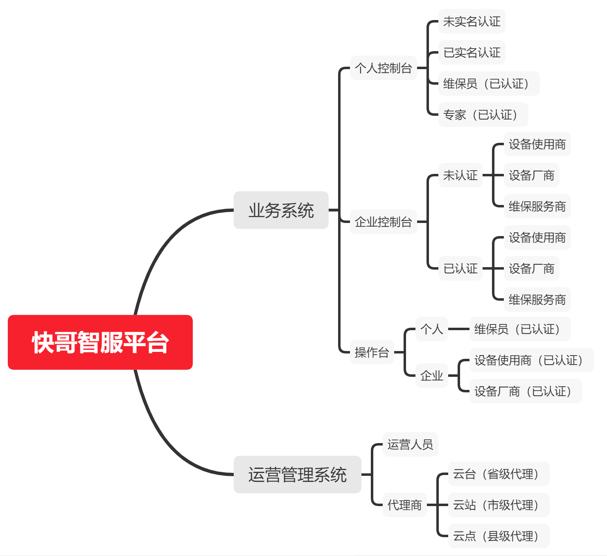

# 快哥智服笔记

- 快哥智服平台登录架构

- 文件上传接口

  见后端开发笔记中的文件上传部分。

- 申请人昵称及真实姓名

  account 表是不是属于底座那边维护的？

  是。

  底座的表和设备组的表是否在同一个数据库中？

  是，account 表在 jnpf_tenant 库中。

  既然一个account对应一个现实中的人，那么姓名、昵称、民族、籍贯等信息为什么会保存在 base_user 表中？

  表设计不合理，遗留问题。

- 一个企业最开始是怎么添加进系统里的？

  两种方式：

  1. 没有注册的用户，可以在登录页面选择企业注册，此时会自动给该用户创建一个账户，同时创建一个企业，并自动将该用户设置为该企业的管理员。
  2. 对于已经注册的用户，登录之后在个人控制台中点击企业管理（目前只有企业控制台有该页面，待做），即可创建企业。

- 账号密码管理

  [【金山文档 | WPS云文档】 快哥智服-账号管理](https://kdocs.cn/l/cg690ipT7NlI)